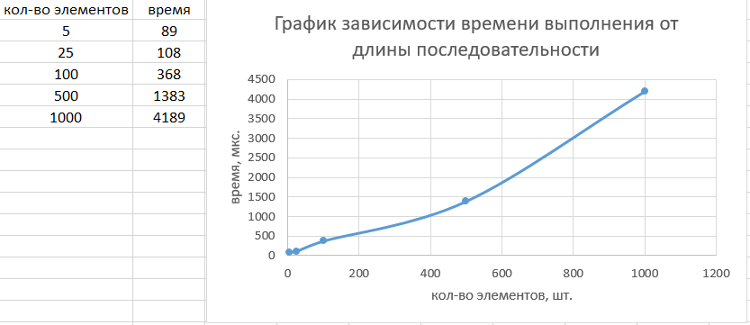

1) Чтобы собрать проект, надо зайти в корень проекта и ввести команду
```javac src\*.java```
2) Чтобы запустить проект, надо зайти в корень проекта и ввести команду
```java -cp src\ Main```
3) В файле ```Main.java``` Программа считывает файл ```data.txt```. Для чисел из этого файла программа считает минимум (функция _min), максимум (функция _max), сумму (функция _sum) и произведение (функция _mult). В этом же файле для каждой последовательности чисел высчитывается время выполнения работы программы. Результаты вычислений выводятся в консоль.
4) Тесты для проверки корректности функций поиска минимума, максимума, суммы, умножения находятся в файле ```ArrayServiceTests.java```. Там же находится тест, который проверяет корректность выполнения программы в случае, если одно из чисел в файле является нулем.
5) 